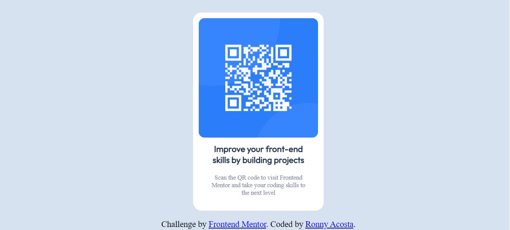
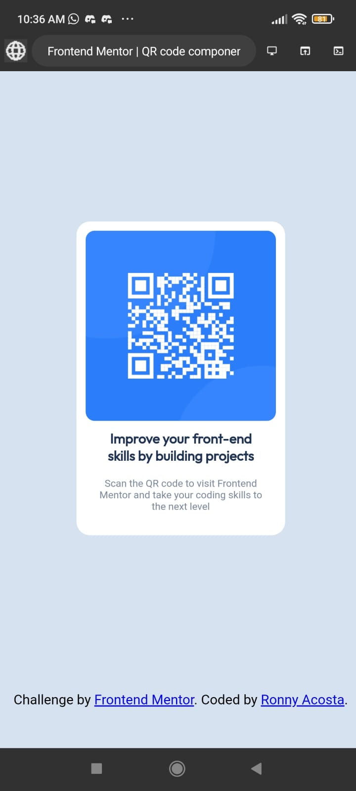

# Frontend Mentor - QR code component solution

This is a solution to the [QR code component challenge on Frontend Mentor](https://www.frontendmentor.io/challenges/qr-code-component-iux_sIO_H). Frontend Mentor challenges help you improve your coding skills by building realistic projects. 

## Table of contents

- [Overview](#overview)
  - [Screenshot](#screenshot)
  - [Links](#links)
- [My process](#my-process)
  - [Built with](#built-with)
  - [Useful resources](#useful-resources)
- [Author](#author)

## Overview

### Screenshot

### Links

- Solution URL: [GitHub](https://github.com/ronnyAcosta/qr-code-component.git)

- Live Site URL: [Netlify](https://qr-code-component-rx.netlify.app/)

## My process

### Built with

- Semantic HTML5 markup
- CSS custom properties
- Flexbox

### Useful resources

- [Aligning Items in a Flex Container](https://developer.mozilla.org/en/docs/Web/CSS/CSS_Flexible_Box_Layout/Aligning_Items_in_a_Flex_Container)

- [Como centrar cualquier cosa en CSS usando Flexbox y Grid](https://www.freecodecamp.org/espanol/news/como-centrar-cualquier-cosa-en-css-usando-flexbox-y-grid/) 

## Author

- Frontend Mentor - [@ronnyAcosta](https://www.frontendmentor.io/profile/ronnyAcosta)

